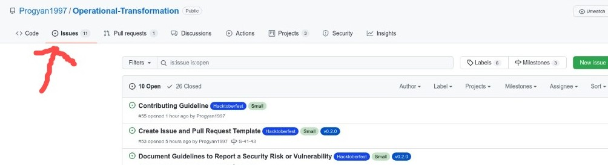
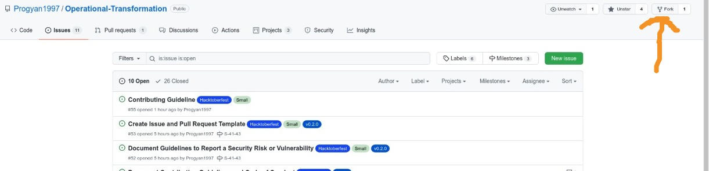
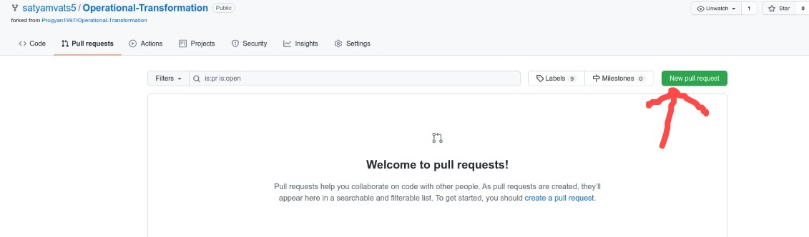

# Contributing Guidelines

This documentation contains a set of guidelines to help you with the contribution process.

Before you start, read our [Code of Conduct](CODE_OF_CONDUCT.md) to keep our community approachable and respectable.

In this guide, you will get an overview of the contribution workflow from engaging in the discussion(s) of building features, contributing a Pull Request, till getting it reviewed and merged.

## New Contributor Guidelines

See the [README](https://github.com/Progyan1997/Operational-Transformation#readme) to get an overview of the project. Here are some helpful resources to get you comfortable with open source contribution:

- [Finding ways to contribute to open source on GitHub](https://docs.github.com/en/get-started/exploring-projects-on-github/finding-ways-to-contribute-to-open-source-on-github)
- [Set up Git](https://docs.github.com/en/get-started/quickstart/set-up-git)
- [GitHub flow](https://docs.github.com/en/get-started/quickstart/github-flow)
- [Collaborating with pull requests](https://docs.github.com/en/github/collaborating-with-pull-requests)

## Submitting Contributions

Below you will find the process and workflow used to review and merge your valuable changes.

### Step 0 : Find an issue

[](https://github.com/Progyan1997/Operational-Transformation/issues)

- Take a look at the Existing Issues or visit [Discussions Section](https://github.com/Progyan1997/Operational-Transformation/discussions/30) to engage into discussion about feature request or bug reporting.
- If the issue doesn't exist in our issue tracker, the maintainer will yield a issue from the discussion with proper description and milestone.
- Once you select an issue, subscribe to it and interact with the maintainer/reporter in regular interval to describe your willingness or progress towards that issue.
- Note: Every pull request in this project should have an associated issue registered.

### Step 1 : Fork the Project

[](https://github.com/Progyan1997/Operational-Transformation.git)

- Fork this Repository. This will create a local copy of this Repository on your Github Profile.
  Keep a reference to the original project in `upstream` remote as shown below.

```bash
$ git clone https://github.com/<your-username>/Operational-Transformation
$ cd Operational-Transformation
$ git remote add upstream https://github.com/Progyan1997/Operational-Transformation
$ git fetch upstream
```

- If you have already forked the project, update your copy before starting to work on the same.

```bash
$ git remote update
$ git checkout <branch-name>
$ git rebase upstream/<branch-name>
```

### Step 2 : Branch

Create a new branch. Use its name to identify the issue you are addressing.

```bash
# It will create a new branch with name Branch_Name and switch to that branch
$ git checkout -b <branch_name>
```

### Step 3 : Work on the issue assigned

- Work on the issue(s) assigned to you.
- Add all the files/folders needed.
- Make sure to add or modify the tests (both unit and integration) to ensure net positive code coverage.
- After you've made changes or made your contribution to the project, add changes to the branch you've just created by:

```bash
# To add all new files to branch Branch_Name
$ git add .

# To add only a few files to Branch_Name
$ git add <some files>
```

### Step 4 : Commit

- Every commit message must follow the [Semantic Commit Structure](https://gist.github.com/joshbuchea/6f47e86d2510bce28f8e7f42ae84c716).

```bash
(category) shortlog: commit title

commit body

fixes: #<issue_number>

Signed-Off-By: [Your name] <your email>
```

- The commit title should explain what the commit does in an imperative manner.
- Commit body should describe the changes. This is optional in case of a dependency update or similar.

### Step 5 : Work Remotely

- When your work is ready and complies with the project conventions, upload the changes to your fork:

```bash
# To push your work to your remote repository
$ git push -u origin <branch_bame>
```

### Step 6 : Pull Request

[](https://github.com/Progyan1997/Operational-Transformation/pulls)

- Go to your repository in browser and click on compare and pull requests.
  Then add a title and description to your pull request that explains your contribution and submit it.
- Voila! Your Pull Request has been submitted and will be reviewed by the moderators.
- Once the changes are successfully reviewed, they will be merged.🥳
