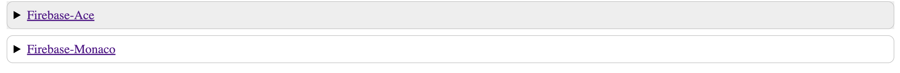
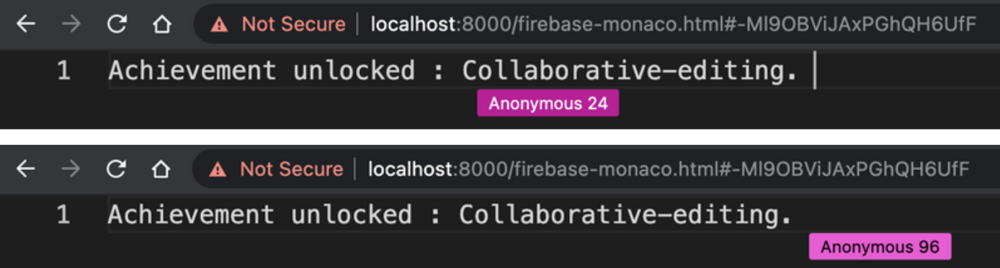

# Collaborative Editor

> One of the use case of the `@otjs` library is to the ability to build a collaborative editor using one or more web based editor and a central database/queue implementation. In this example, this use case has been well demonastrated with almost no code setup.

## Purpose

This example can help you get familiar with the API usage of `@otjs/firebase-ace` and `@otjs/firebase-monaco`.

## Prerequisites

If you followed the [installation](https://github.com/0xTheProDev/Operational-Transformation#installation) steps successfully, you would have `lerna` and `yarn` installed globally.

Before running this example, it's necessary to build all the packages using `yarn build` in the root (Operational-Transformation) directory.

Also, the **_firebase.json_** in this directory has `database` entry where `rules` point to `".firebase/database.rules.json"` file which is not included with this repository. The user can add their own file with custom rules.

For development purpose, the following can be the content of this file :-

```
{
  "rules": {
    ".read": true,
    ".write": true
  }
}
```

## Running

The example doesn't need the user to be authenticated with **firebase** since it runs local **firebase-emulator** for development purposes.

- Run `yarn start` from the root of this directory to fire up both the emulator and the collaborative-editors UI (accessible at **localhost:8000**).
  

- Click on the editor you want to test and you will be redirected to it.
- Copy the url and paste it in a new tab to open another session.
- Start collaborating 🤝
  
